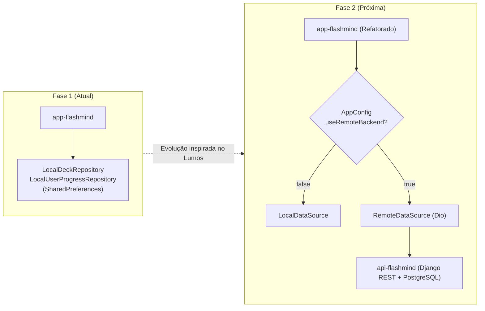

---
tags:
  - indice
  - projeto/flashmind
---
# FlashMind — Mapa de Arquitetura e Conhecimento

> Vault Obsidian com documentação viva e mapeamento de dependências do ecossistema **FlashMind**. Conecta **telas → componentes → controllers/services → repositories → models/entidades**.

Atualmente, o projeto conta com o aplicativo mobile Flutter (**`app-flashmind`**) em funcionamento pleno (*local-first*), com a API backend (**`api-flashmind`**) em fase de planejamento para sincronização na nuvem.

Comece por [[Arquitetura do App Flutter]] ou veja o [[Plano de Transição para a API]].

---

## 🎯 Domínios do Sistema

| Domínio | O que cobre | Documento |
|---|---|---|
| **Estudo e SRS** | Algoritmo de repetição espaçada (SM-2 adaptado), sessões de revisão, flip de cartões e avaliação | [[Repetição Espaçada e Sessão]] |
| **Decks e Flashcards** | Criação, edição, exclusão e validação de baralhos e cartões de estudo | [[Gestão de Decks e Cartões]] |
| **Gamificação e Progresso** | Sistema de XP, níveis (1 a 10+), títulos de maestria, combos, streak diário e calendário | [[Gamificação e Progresso]] |
| **Home e Experiência** | Dashboard principal, frases motivacionais, métricas rápidas, onboarding e alternância de tema | [[Experiência do Usuário e Home]] |
| **Persistência e Escopo** | Injeção via `AppScope`, repositórios locais em SharedPreferences e seeds de estudo | [[Persistência e Arquitetura]] |

---

## 📊 Números do App FlashMind

| Métrica | Quantidade | Observações |
|---|---|---|
| **Telas Principais (Screens)** | **8** | Home, Decks, DeckDetails, CreateDeck, Session, CreateCard, EditCard, Streak |
| **Componentes e Widgets** | **23** | Cards, headers, banners de conquista, botões SRS, calendário de streak, bottom sheets |
| **Modelos de Domínio** | **6** | `Deck`, `Flashcard`, `UserProgress`, `ReviewRating`, `FlashcardAchievement`, `Quote` |
| **Services e Controllers** | **7** | `DeckService`, `ReviewService`, `SpacedRepetitionService`, `GamificationService`, `UserProgressController`, `DeckDetailsController`, `CreateDeckController` |
| **Repositórios** | **4** | `DeckRepository` (Local e In-Memory) e `UserProgressRepository` (Local e In-Memory) |
| **Decks Pré-carregados (Seed)** | **7** | SQL, OOP, Linux, Git, Programming Fundamentals, Linux Scenario, SQL Scenario |
| **Intervalos de SRS** | **10** | De 1 minuto a 30 dias de espaçamento |
| **Níveis de Avaliação** | **3** | `forgot` (Não sabia), `difficult` (Difícil), `easy` (Fácil) |

---

## 🧭 Por onde entrar

| Você quer entender ou alterar… | Abra |
|---|---|
| A estrutura e fluxo de dados do Flutter | [[Arquitetura do App Flutter]] |
| O algoritmo de cálculo de revisão e intervalos | [[Algoritmo SRS e Gamificação]] |
| Uma tela específica e seus componentes filhos | Pasta `ui/flutter/` (ex: [[HomeScreen]], [[FlashcardSessionScreen]]) |
| Um modelo de dados ou entidade | Pasta `models/flutter/` (ex: [[Deck]], [[Flashcard]], [[UserProgress]]) |
| A camada de serviço, repositório ou injeção | Pasta `clientes/flutter/` (ex: [[AppScope]], [[DeckService]]) |
| Como será estruturada a futura API em Django REST | [[Plano de Transição para a API]] e [[Contrato Futuro da API]] |
| Como manter e rodar scripts deste vault | [[Como manter este vault]] |

---

## 🏷️ Convenções de Tags

As tags no vault classificam os nós por tipo de artefato e camada arquitetural:

| Tag | Significado | Exemplo |
|---|---|---|
| `#router/screen` | Tela navegável completa | [[HomeScreen]], [[FlashcardSessionScreen]] |
| `#component/flutter` | Widget ou componente reutilizável | `streak_calendar.dart`, `answer_buttons.dart` |
| `#model/flutter` | Entidade ou modelo de dados do app | [[Deck]], [[Flashcard]], [[UserProgress]] |
| `#service/flutter` | Serviço de regra de negócio pura ou orquestração | [[SpacedRepetitionService]], [[ReviewService]] |
| `#controller/flutter` | Controller ou gerenciador de estado reativo | [[UserProgressController]], `streak_controller.dart` |
| `#repository/flutter` | Contrato abstrato ou implementação de repositório | [[DeckRepository]], [[UserProgressRepository]] |
| `#feature/decks` | Relacionado à feature de baralhos | Baralhos, detalhes, criação |
| `#feature/flashcards` | Relacionado à feature de cartões e SRS | Sessão, flip, avaliação, intervalos |
| `#feature/progress` | Relacionado à feature de progresso e streak | Streak, histórico, calendário |
| `#feature/home` | Relacionado ao dashboard principal | Nível, XP, frases, resumo |
| `#core/app` | Infraestrutura central transversal | [[AppScope]], inicialização |

---

## 🗺️ Fluxo de Dados Atual (Local-First)

```text
Widget / Screen
    ↓ lê/escuta
Controller / ChangeNotifier (DeckService / UserProgressController)
    ↓ delega orquestração
ReviewService
    ↓ calcula regras
SpacedRepetitionService & GamificationService
    ↓ persiste estado
DeckRepository / UserProgressRepository (LocalSharedPreferences)
```

---

## 🚀 Rota de Evolução: Do App Local à API Compartilhada



Consulte [[Plano de Transição para a API]] para ver o passo a passo técnico da migração.
