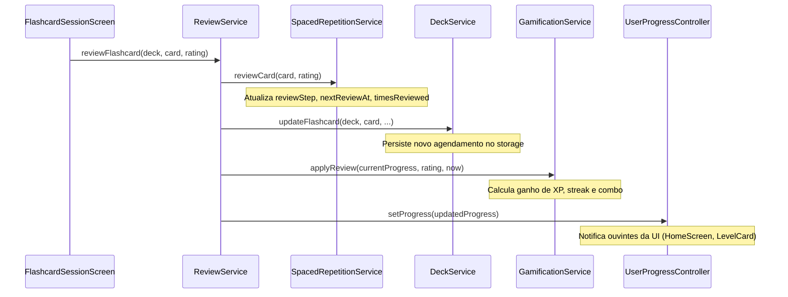

---
tags:
  - service/flutter
  - feature/flashcards
  - srs
---
# Service: ReviewService

Orquestrador de alto nível do ciclo de revisão de flashcards. Conecta o algoritmo matemático de repetição espaçada, a persistência de baralhos e a gamificação de progresso.

- **Arquivo no App**: [`lib/core/review/review_service.dart`](file:///home/jonas/Projects/flashmind/app-flashmind/lib/core/review/review_service.dart)
- **Domínio**: [[Repetição Espaçada e Sessão]]

---

## 📋 Dependências e Construtor

```dart
class ReviewService {
  final SpacedRepetitionService _spacedRepetitionService;
  final GamificationService _gamificationService;
  final UserProgressController _userProgressController;
  final DeckService _deckService;

  ReviewService({
    required SpacedRepetitionService spacedRepetitionService,
    required GamificationService gamificationService,
    required UserProgressController userProgressController,
    required DeckService deckService,
  });
}
```

---

## ⚙️ Método Central: `reviewFlashcard`

Quando o estudante seleciona uma avaliação na [[FlashcardSessionScreen]]:



---

## 👥 Quem Consome

- Injetado em: [[AppScope]]
- Consumido por: [[FlashcardSessionScreen]]
