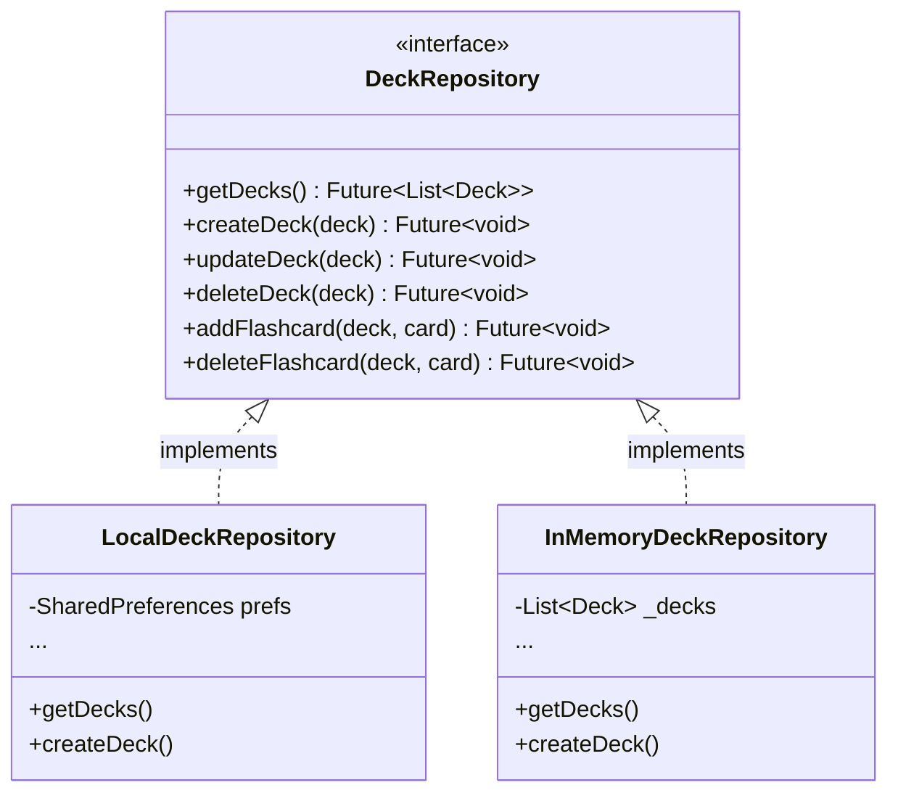

---
tags:
  - dominio
  - arquitetura
  - persistencia
---
# Domínio: Persistência e Arquitetura

Este domínio documenta como o **FlashMind** organiza suas dependências, provê serviços para a árvore de widgets e gerencia a persistência de dados localmente.

---

## 💉 Injeção de Dependências via [[AppScope]]

Em vez de bibliotecas pesadas de DI, a versão atual do app utiliza um padrão elegante e nativo de **`InheritedWidget`** encapsulado na classe [[AppScope]]:

```dart
class AppScope extends InheritedWidget {
  final DeckService deckService;
  final UserProgressController userProgressController;
  final ReviewService reviewService;

  static AppScope of(BuildContext context) {
    final scope = context.dependOnInheritedWidgetOfExactType<AppScope>();
    assert(scope != null, 'No AppScope found in context');
    return scope!;
  }
}
```

Isso permite que qualquer tela ou widget acesse os serviços essenciais de forma desacoplada com:
```dart
final deckService = AppScope.of(context).deckService;
final userProgress = AppScope.of(context).userProgressController;
final reviewService = AppScope.of(context).reviewService;
```

---

## 💾 Estratégia de Persistência Local

Todos os dados do usuário são serializados como JSON em `SharedPreferences`:

| Chave | Tipo Armazenado | Conteúdo | Responsável |
|---|---|---|---|
| `'decks'` | `String` (JSON List) | Lista completa de baralhos, cartões e agendamentos | `LocalDeckRepository` |
| `'user_progress'` | `String` (JSON Object) | XP, streak, dias de estudo e métricas diárias | `LocalUserProgressRepository` |
| `'theme_mode'` | `int` | Índice do enum `ThemeMode` (0: system, 1: light, 2: dark) | `FlashcardAppState` |

---

## 🏛️ Padrão Repository e Testabilidade

O projeto adota formalmente o padrão **Repository**, separando a regra de negócio da forma como os dados são guardados:



A existência de `InMemoryDeckRepository` e `InMemoryUserProgressRepository` permite rodar testes de unidade e de widget em milissegundos, sem mockar plugins do Flutter!

---

## 🔗 Próximo Passo Arquitetural

Para preparar a chegada do backend **`api-flashmind`**, a arquitetura evoluirá para o padrão com **Dual-DataSource** (seguindo o mesmo modelo do projeto Lumos). Veja todos os detalhes em [[Plano de Transição para a API]].
