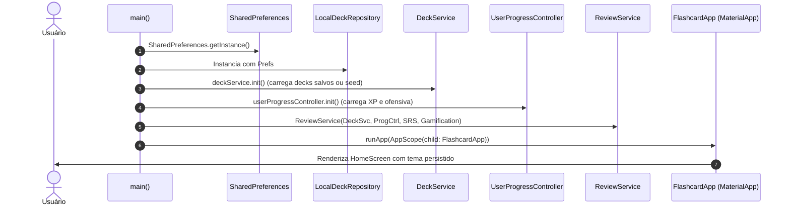

---
tags:
  - guia
  - arquitetura
  - flutter
---
# Guia: Arquitetura do App Flutter (`app-flashmind`)

Este guia detalha a estrutura de código, decisões de design, convenções e padrões utilizados no aplicativo Flutter **FlashMind**.

---

## 🏗️ Filosofia e Visão Geral

O `app-flashmind` foi construído com foco em **simplicidade, robustez local-first e baixo acoplamento**:
- **Zero Dependências Pesadas**: Utiliza os recursos nativos do Flutter (`InheritedWidget`, `ChangeNotifier`, `ValueNotifier`) e `shared_preferences`.
- **Organização Feature-First**: O código é dividido em pacotes focados nas funcionalidades (`features/decks`, `features/flashcards`, `features/home`, `features/progress`), além de uma pasta `core/` para utilitários transversais.
- **Camada de Repositório Abstrata**: Permite alternar entre armazenamento persistente e em memória instantaneamente.

---

## 📂 Árvore de Diretórios de `lib/`

```text
lib/
├── main.dart                      # Ponto de entrada, temas e inicialização
├── core/                          # Recursos transversais compartilhados
│   ├── app_scope.dart             # Injeção de dependência via InheritedWidget
│   ├── progress/                  # Módulo global de progresso do usuário
│   │   ├── controllers/           # UserProgressController
│   │   ├── models/                # UserProgress
│   │   ├── repositories/          # UserProgressRepository (Local e In-Memory)
│   │   └── services/              # GamificationService (XP e Streak)
│   └── review/                    # Orquestrador de revisão
│       └── review_service.dart    # ReviewService
│
└── features/                      # Fatias verticais por funcionalidade
    ├── home/                      # Dashboard inicial
    │   ├── data/                  # Quotes e dados estáticos
    │   ├── models/                # Quote, StatsData
    │   ├── screens/               # HomeScreen
    │   └── widgets/               # LevelCard, StatsSection, QuoteCard, StartButton...
    │
    ├── decks/                     # Gestão de baralhos
    │   ├── controllers/           # DeckDetailsController, CreateDeckController
    │   ├── data/                  # Seeds de baralhos (SQL, Linux, Git, etc.)
    │   ├── models/                # Deck
    │   ├── repositories/          # DeckRepository (Local e In-Memory)
    │   ├── screens/               # DecksScreen, DeckDetailsScreen, CreateDeckScreen
    │   ├── services/              # DeckService (ChangeNotifier central)
    │   └── widgets/               # DeckList, DeckListItem, DecksSummary...
    │
    ├── flashcards/                # Sessão de repetição espaçada e cartões
    │   ├── controllers/           # CreateFlashcardController, EditFlashcardController
    │   ├── models/                # Flashcard, ReviewRating, FlashcardAchievement
    │   ├── screens/               # FlashcardSessionScreen, Create/EditFlashcardScreen
    │   ├── services/              # SpacedRepetitionService (SM-2)
    │   ├── utils/                 # ReviewUtils
    │   └── widgets/               # FlashcardView, AnswerButtons, SessionProgress...
    │
    └── progress/                  # Calendário e detalhes de ofensiva
        ├── controllers/           # StreakController
        ├── screens/               # StreakScreen
        └── widgets/               # StreakCalendar
```

---

## 🔄 Fluxo de Execução e Inicialização (`main.dart`)

Quando o aplicativo é iniciado:



---

## 🎯 Padrões de Gerenciamento de Estado

O projeto utiliza intencionalmente abordagens leves:
1. **`ChangeNotifier`** para serviços com múltiplos consumidores:
   - [[DeckService]]: Notifica adições, edições e remoções de baralhos para que `HomeScreen`, `DecksScreen` e `DeckDetailsScreen` se atualizem automaticamente.
   - [[UserProgressController]]: Notifica ganho de XP e alterações de nível para sincronizar o card de progresso.
2. **`StatefulWidget` com `setState` local** para animações efêmeras e fluxo de telas (ex: virar o cartão em [[FlashcardSessionScreen]] ou controlar abas).
3. **Controladores dedicados** para formulários e telas pontuais (`CreateDeckController`, `StreakController`), evitando poluírem os widgets visuais com regras de validação.

---

## 🧪 Estratégia de Testes (`test/`)

O diretório `test/` espelha fielmente a arquitetura:
- `test/core/progress/`: Testes de cálculo de XP, progressão de nível e cálculo de ofensiva (`gamification_service_test.dart`).
- `test/features/decks/`: Testes de validação de títulos únicos, adição/remoção de cartões com `InMemoryDeckRepository`.
- `test/features/flashcards/`: Testes unitários do algoritmo SRS, garantindo que `ReviewRating.forgot` reinicie o passo e `ReviewRating.easy` aumente o intervalo.
- `test/features/home/`: Testes de widget garantindo renderização correta de cards e navegação.
