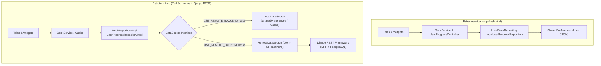

---
tags:
  - guia
  - arquitetura
  - migracao
  - api
---
# Guia: Plano de Transição para a API (`api-flashmind`)

Este documento estabelece o roteiro técnico para conectar o aplicativo mobile (`app-flashmind`) ao futuro backend em **Django REST Framework** (`api-flashmind`), replicando a robustez arquitetural observada no ecossistema **Lumos**.

---

## 🎯 Objetivo Arquitetural

Transformar o atual aplicativo local-first em um sistema híbrido com **Dual-DataSource** e alternância por flags de ambiente (`--dart-define`), preservando o funcionamento offline/mock para desenvolvimento ágil e testes de UI.



---

## 🪜 Roteiro de Implementação em 4 Etapas

### Etapa 1: Estruturação do Backend Django REST (`api-flashmind`)
1. Inicializar ambiente virtual com `uv` (`uv venv && source .venv/bin/activate`).
2. Instalar dependências essenciais:
   - `django>=5.1`
   - `djangorestframework>=3.15`
   - `djangorestframework-simplejwt>=5.3` (Access + Refresh tokens)
   - `django-cors-headers`
   - `psycopg[binary]>=3.2`
   - `pytest-django`
3. Estruturar o projeto com **Split Settings**:
   - `config/settings/base.py`
   - `config/settings/development.py` (SQLite local ou PostgreSQL em Docker)
   - `config/settings/production.py`
4. Criar os apps de domínio:
   - `apps/authentication/` (Custom User, SimpleJWT endpoints: login, refresh, me)
   - `apps/decks/` (Models `Deck`, `Flashcard`, Serializers e ViewSets)
   - `apps/progress/` (Model `UserProgress`, histórico diário, endpoint de sincronização)
5. Habilitar o **Django Admin** (`/admin/`) para gerenciar facilmente baralhos, cartões e usuários.

---

### Etapa 2: Configuração de Build no Flutter (`dart_defines/`)
Criar perfis de execução no `app-flashmind`:

- `dart_defines/local.json`:
  ```json
  {
    "USE_REMOTE_BACKEND": false,
    "API_BASE_URL": "http://localhost:8000/api"
  }
  ```
- `dart_defines/dev.json`:
  ```json
  {
    "USE_REMOTE_BACKEND": true,
    "API_BASE_URL": "http://10.0.2.2:8000/api"
  }
  ```

Criar `lib/core/config/app_config.dart`:
```dart
class AppConfig {
  const AppConfig._();

  static const bool useRemoteBackend = bool.fromEnvironment(
    'USE_REMOTE_BACKEND',
    defaultValue: false,
  );

  static const String apiBaseUrl = String.fromEnvironment(
    'API_BASE_URL',
    defaultValue: 'http://localhost:8000/api',
  );
}
```

---

### Etapa 3: Cliente de Rede e Camada Remota no Flutter
1. Adicionar `dio` e `flutter_secure_storage` no `pubspec.yaml`.
2. Criar `lib/core/network/api_client.dart` com interceptor automático de Bearer Token e renovação transparente via `/api/auth/refresh/` no erro `401`.
3. Para cada repositório existente, separar em:
   - Contrato abstrato `*DataSource`
   - `*LocalDataSource` (reaproveitando a lógica atual do `SharedPreferences`)
   - `*RemoteDataSource` (chamando os endpoints DRF via `ApiClient`)
   - `*RepositoryImpl` que consome a datasource ativa injetada.

---

### Etapa 4: Estratégia de Sincronização e Conflitos (Offline-First)
Como os flashcards podem ser estudados sem sinal de internet:
1. Toda revisão executada offline é gravada localmente com timestamp e status `pending_sync = true`.
2. Quando a conectividade for restabelecida, o app envia um lote para `POST /api/progress/sync/`.
3. A regra de resolução de conflitos segue o padrão **"Maior `timesReviewed` vence"** ou **"Mais recente vence"** (`lastReviewedAt`).
